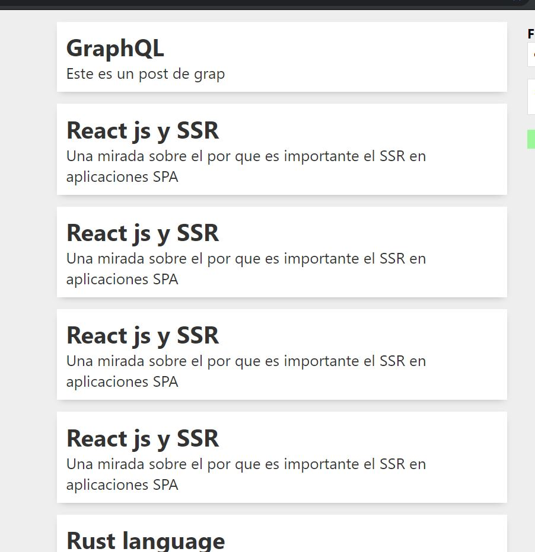

# GraphQl curso introductorio
## Este curso pretende dar un primer acercamiento a grapql. Entender lo que es, sus componentes principales y cúales son los beneficios que ofrece.

### Contenido del curso:

**Índice**
1. [Tema 1: ¿Qué es GraphQL?](#id1)
2. [Tema 2: Hola mundo con Grapql,Nodejs, express](#id2)
3. [Tema 3: Definición de Schema y de tipos](#id3)
4. [Tema 4: Resolvers](#id4)
5. [Tema 5: Conexión con Base de datos](#id5)
6. [Tema 6: Fragments, Interfaces, Unions](#id6)

<div id='id1'/>

#### Tema 1: ¿Qué es GraphQL?

- GraphQL es un lenguaje de consulta para su API. Una de las carácteristicas principales de GraphQL es que te permite traer solo los datos que en realidad necesitas.
  GraphQL en realidad es una especificación, no una implementación. Por esta razón GraphQL es agnóstica al lenguaje y/o plataforma. Puedes correr GraphQL tanto del lado del cliente, como del servidor. GraphQL Puede ser ejecutado con **Javascript**, **pyhton**, **c#**, entre otros.
  
  Al tratarse de una especificación, pueden existir multiples clientes(implementaciones) incluso para una misma plataforma. Algunos de los clientes más conocidos para GraphQL son **Relay y Apollo**. Relay fue creado por facebook quien además fué el creado de GraphQL; Relay se integra perfectamente con **ReactJS**  que es una libreria para el desarrollo de UI, creada también por facebook. Por su parte Apollo es un cliente open source creado por Meteor Development Group. Apollo es agnóstica a frameworks.
   
  En los próximos temas veremos más en profundidad como está compuesto GraphQL.
  también puedes visitar:
  https://graphql.org/learn/


- GraphQl y API REST

  Explicaremos algunas diferencias entre GraphQL y las API REST

  - Mientras en REST solemos exponer multiples   endpoints, para consultar la información  requerida, con GraphQL tenemos un único endpoint, y sobre el ejecutamos las consultas necesarias.

  - Con GraphQL traemos únicamente la data que nos interesa. Así nos evitamos lo que si puede llegar a suceder con las API REST(Over Fetching, Under Fetching) es decir que traemos datos que realemente no necesitamos, o por el contrario que nos hacen falta datos.

  - Versionado: Si se necesita dar soporte al versionado de una API, con rest esto tal vez signifique crear nuevos endpoints, lo cual impacta directamente el posterior mantenimiento. Mientras que con GraphQL podemos simplemente añadir más campos o tipos, sin que esto implique romper los queries existentes.
  Más adelate ahodaremos en los tipo en GraphQL.

<div id='id2'/>

#### Tema 2: Hola mundo con Graphql,Nodejs, express

- Instalación de GraphQl,express,Apollo
  
  Como se mencionó en el apartado anterior, existen multiples cliente para GraphQL en multiples plataformas. Para este curso, utilizaremos **Nodejs** que es el runtime que nos permite ejecutar **Javascript** del lado del servidor. Utilizaremos además **express** es un framework lijero que nos permite crear apliaciones web de forma rápida sobre Nodejs. Y como cliente de GraphQL utilizaremos Apollo
  
  **Nota:** Daré por hecho que conoces los fundamentos de Nodejs, por lo que no me detendré a explicarlos

- Hola Mundo

  Primero que nada crearemos nuestro proyecto Node e instalaremos las dependencias necesarias

  - Creamos una carpeta para el proyecto, en mi caso la llameré course

  - Iniciamos un nuevo proyecto
    ``` 
     npm init --yes
    ```
  - Instalamos las dependencias
    ```
      npm install  graphql express apollo-server apollo-server-express nodemon
    ```

  - Ahora crearmos la estructura de directorios para el proyecto
    - Creamos la carpeta src
    - Dentro de src creamos una carpeta llamada hello
    - Dentro de hello crearemos el archivo app.js
    

  - Dentro del package.json añadimos un script
    ```
     "scripts": {
         "dev": "nodemon src/hello/app.js"
      }
 
    ```
  - En app.js  importamos las dependecias que necesitamos
    ```
     const express = require('express')
     const {ApolloServer,gql} = require('apollo-server-express')
    ```
  - Inicializamos express, los typeDefs y los resolvers
    ```
      const app = express();
      const typeDefs = gql`
        type Query{
            me: User
        }
        
        type User{
            id: ID!
            name: String!
        }
      const resolvers = {
           Query:{
                me:()=> {
                    return {
                        name:'Developer'
                        }
                }
            }
      }
    ```
    - Para definir los typeDefs utilizamos gql que es un Tagged Template Literals que nos da la habilidad de llamar funciones utilizando el poder de los template strings

    - Definimos un type Query que nos va permitir correr nuestra consulta

    - Definimos un type User que tiene dos campos ID que es un string único. El signo ! indica que el campo es obligtario(no-nullable). Támbien definimos el campo name que es un String y tambíen es obligatorio.

    - También definimos un resolve para obtener los datos. Los resolvers son una colección de funciones encargadas de obtener los datos que requerimos.
  - Ahora inicializamos Apollo server y pasamos  app(express) a 
    la función applyMiddleware() del servidor.

    ```
    const server = new ApolloServer({
      typeDefs,
      resolvers
      });
    
     server.applyMiddleware({app});
    
    ```
    - ApolloServer requiere 2 parámetros: los typeDef y los resolvers
  
  - Ahora le decimos al servidor que escuche el puerto que     deseamos 
    ``` 
     app.listen(3000,()=> console.info("Running....."));
    ```
  - Por último, corremo el comando que definimos el package.json para ejecutar nuestra aplicación.
    - En la terminal corremos el siguiente comando.
    ```
      npm run dev
    ```
    Esto nos levanta la aplicación el puerto indicado.
- En este punto en el navegador colocaremos la siguiente url
para probar nuestra aplicación.

```
 http://localhost:3000/graphql
```
- En lado izquierdo de la pantalla que nos habilita, corremos la siguiente consulta.
```
   { 
    me{
      name
    }
  }
```
Y al darle al botón play nos corre la consuta.
  


<div id='id3'/>

#### Tema 3: Definición de Schema y de tipos
   Un Schema en GraphQl nos permite describir la funcionalidades disponibles
   para nuestra aplicación. 
   Distinto a Rest que se depliega como una colección de Endpoints, en GraphQl pensamos y hablamos en tipos de datos y nuesta API expone una colleción de tipos datos
   que llamamos Schema.
   Los Schema se construyen a principalmente a partir de types y resolvers. 

   GraphQl provee roots types, que ya vienen integrados a la especificación, pero también nos permite definir nuevos types.

   Root Types:
   
   ``` 
    const typeDefs = gql`
        type Query{...}
        type Mutation{...}
        type Subscription{...}
        `
     
   ```
  Para explicar los types, crearemo una pequeña aplicación que llamé miniTwitter. El código estará disponible dentro de este mismo repositorio.

  #### type Query
   Con el type Query podemos definir todas las consultas(queries) que se pueden hacer a traves de nuestro aplicación. Por Ejemplo:
   ```
     const typeDefs = gql`
        type Query{
          totalTwitts:Int!,
          allTwitts:[Twitt!]!,
          allUsers:[User!]!   
        }
      `
   ```
  
  Como se puede ver, en la definición del type Query incluimos consultas de direfentes tipos. 
  - totalTwitts:Int!: nos devuelve un entero (Scalar type)
  - allTwitts:[Twitt!]! devuelve una lista que contiene un type definido por nostos llamado Twitt.
  - allUsers:[User!]! devuelve una lista que contiene un type definido por nostos llamado User.


  #### type Mutation
  La diferencia entre Mutation y Query es la intención. Mientras Query nos permite consultar, Mutation se usa cuando se desea cambiar el estado de nuestra aplicación. Cabe resaltar que podemos usar Query dentro de Mutation, si requerimos consultar alguna información del usario que creo el twitt por ejemplo.
  Mutation Son las acciones que los usuarios pueden hacer con nuestro servicio.

  Por ejemplo:
  ``` 
     const typeDefs = gql`
      type Mutation{
          createTwitt(text:String!):Twitt!,
          createUser(name:String!, email:String!):User!
        }
      `
  ```
  Con Mutation definimos las acciones que puede hacer el usario; en este caso,
  hemos definido las siguientes:

  - **createTwitt(text:String!):Twitt!**
    - Estamos definiendo que  los usurios de nuestro servicio pueden crear twitts. 
      Para ello le pedimos que debe pasar como parámetro, un texto (text:String!) y definimos también que se debe retornar un type Twitt.
  - **createUser(name:String!, email:String!):User!**
    - Los usuarios de nuestro servicio, se pueden registrar y crear su propia cuenta, para eso creamos esta definición. Indicamos que se deben pasar dos parámetros de tipo String(name, email). A su vez esta definición debe retornar un type User.

  **Nota:**
   Tanto en las definiciones anteriores, como en el ejemplo de Query hacemos uso del símbolo(!). Este símbolo indica que el parámetro o el type donde es aplicado no puede ser nulo, es decir hace obligatorio el elemento donde es aplicado ejemplo: createUser(name:String!, email:String!) ambos parametros son requeridos. Si se quisiera permitir parametros opcionales, no se usa el símbolo(!) por ejemplo: createUser(name:String, email:String)

  
  #### type Subscription
  Subscription nos permite implementar en nuestro servicio funcionalidad en tiempo real. Pero hablaremos de Subscription en un tema aparte dedicado solo este type.

  
  #### Tipos definidos por nosotros.
  Un servicio en GraphQL se construye a base de tipos(type). Por supuesto podemos definir nuestros propios tipos que reflejan la información que se puede consultar a través de nuestro servicio.

  Un type está compuesto de una serie de campos(clave - valor), que son la definición  de la información que ese type en particular debe tener.
   Por ejemplo:

  ```
  const typeDefs = gql`
      type Twitt{
          id: ID!
          text: String!,
          date: Date!,
          creator: User!
      }
   `
  ```

  En el ejemplo anterior, definimos el type Twitt. Este a su vez, tiene los siguientes campos:
   - **id:** es de tipo ID, que es una cadena única que identifica al objeto. Podemos notar que usar el símbolo(!) lo que indica que este campo no puede ser nulo.
   - **text:** campo de tipo String y también es obligatorio.
   - **date:** campo de un tipo Scalar definido por nostros. No puede ser nulo.
   - **creator:** este campo define una relación entre el  type Twitt con otro tipo el type User, que definiremos en un momento. Este campo hace referencia al usuario que creo el Twitt, por lo tanto no puede ser nulo.

  Creamos ahora el type User.
  ```
  const typeDefs = gql`
      type User{
       id: ID!,
       name: String!
       email: String!
      }
   `
  ```
  Este nuevo type  tiene los siguientes campos
  - **id** De tipo ID, identificador único que no puede ser nulo.
  - **name** De tipo String y es obligatorio.
  - **email** Tambien de tipo String y no puede ser nulo.


  Como pudimos ver en el type Twitt utilizamos un valor Scalar de tipo Date. Pero para poder utilizarlo debemos definirlo.
  ```
   const typeDefs = gql`
      scalar Date 
    `
  ```

  Ahora sabemos que los Schema en GraphQl se construyen a traves de definiciones de tipos. 
  Un Shcema describe la forma de los datos, pero no los obtiene por si mismo este trabajo lo hacen los resolvers que vermos en el siguiente tema.


<div id='id4'/>

#### Tema 4: Resolvers
   Los resolvers son funciones que se encargan de retornar los datos para campos particulares. Los datos son retornados en los tipos y formas definidos en el Schema.

   Los resolvers pueden ser asíncronos y con ellos podemos actualizar datos desde una API rest, una base de datos, o cualquier otro tipo de servicios. Estos pueden retornar objetos(tipos) o valores scalares como Strings, Int,etc.

   Los resolvers son un punto clave en la implentación de GraphQL.

   Definamos nuestros resolvers

  ```
   const resolvers = {
    Query:{
        totalTwitts:()=> twitts.length,
        allTwitts:()=> twitts,
        allUsers:()=> users
    }  
  }
  ```

  Como vemos generamos los resolver para nuestras consultas(Query resolver). Creamos las siguentes 3 funciones:
  - totalTwitts: que nos devuelve un scalar de tipo entero.
  - allTwitts: que nos devuelve una lista de objectos del tipo Twitt.
  - allUsers: esta funcion nos devuelve una lista de objetos de tipo User.

  Es muy importante observar, que  la funciones definidas dentro del Query resolver, siguen la definición del Schema; es decir si recordamos la definición que type Query, podemos ver que los resolver que escribimos aquí son un fiel reflejo de esa definición.

  Continuando con nuestros resolvers:

  ```
   const resolvers = {
    Query:{
        totalTwitts:()=> twitts.length,
        allTwitts:()=> twitts,
        allUsers:()=> users
    },  
     Mutation:{
        createTwitt:(parent, payload)=>{
              const newTwitt ={
                  id : uuidv4(),
                  ...payload,
                  date: Date.now()
              }
              twitts.push(newTwitt)
              return newTwitt
        },
        createUser:(parent, payload)=>{
            const newUser ={
                id: uuidv4(),
                ...payload
            }
            users.push(newUser)
            return newUser
        }
    }
  }
  ```
  Ahora añadimos el Mutation resolver. Al igual que en Query en Mutation, definimos funciones, que nos ayudaran a actualiar o cambiar el estado de la aplicación.

  Podemos ver que los resolvers puede recibir parámetros. Hablaremos des estos parámetros acontinuación:
  
  - root o parent: Hace referencia al root resolver previo, es decir al root donde se encuentra definida la funcion.
    ```
    Mutation:{
          createTwitt:(parent, payload)=>{...},
    }
    ```
    En código anterior observamos que la función createTwitt recibe como primer parámetro parent(root). En este caso el Root es Mutation resolver.

  - payload o args: Son los argumentos que pasamos en la definición del Schema.
    Si recordamos, la definición del type Mutation luce así:
    ```
      type Mutation{
          createTwitt(text:String!):Twitt!,
          createUser(name:String!, email:String!):User!
        } 
    ```
    
    Vemos que la implementación en Mutation resolver se orienta por la difinición en type Mutation del Schema. Allí por ejemplo en la función createUser(name:String!, email:String!), definimos que reciben 2 parámetros: name, email. En los resolvers, todos los  parámetros que definamos vienen dentro de payload por lo que podríamos hacer lo siguiente dentro de la función:
    ```
      const {name, email} = payload
      // ó 
      payload.name
    ```
    Para acceded a los parametros definidos en el Schema.
- context: un objeto mutable que se provee a todos los resolvers
- info: Información relevante acerca del query


<div id='id5'/>

#### Tema 5: Conexión con base de datos
   Hasta el momento hemos utilizado la información en memoria, valiendonos de arreglos. Pero ahora para el siguiente ejercicio, nos conectaremos a una base de datos. Para GraphQL es indiferente a que fuente de datos se quiere conectar(Se puedes usar Mysql, Mongo, SQl Server, Postgres, etc).
   Pero antes de conectarnos hablemos un poco del contexto(Context).

   **Context:**
   Como lo definimos en el tema de los resolvers, el contexto es un objeto en el que alojamos información, que puede ser accedida desde cualquier resolver. Por lo que lo hace ideal para guardar información de autenticación, información de la base de datos, etc.
   Desde dentro de un resolver se pudiera llamar directamente la base de datos, o hacer un llamado a una API REST. pero es más común por separación de responsabilidades,  extraer esa lógica en un objeto y ponerla en el contexto.

   **Continuamos:**
   Ya que conocemos un poco mejor lo que es el context, es momento para realizar nuestro trabajo con base de datos. Para esto utilizaremos, Nodejs junto a Mongodb, y realizaremos un pequeño front en Reactjs que se conecte a la api grapql.

   Dentro el archivos del Backend se encuentran dentro la carpte course/src/connection. Los del front los encontrarás en front/blog. No es importante que sepas React, lo único que se pretende es ver un pequeño caso un poco más realista de como usar graphql.
  
   **Parte 1 - Backend:**

   Para el construir nuestra API, vamos a instalar el paquete mongodb:
   ```
     yarn add mongodb
   ```
   El anterior comando nos añadirá mongo a las dependecias de proyecto. Mongo es una base de datos NoSql. Mongo es una base de datos basada en documentos, lo que quiere decir que los datos no son guardados en tablas, si no en una estructura de datos similar a JSON(BSON)

   Además de  mongo instalaremos otra nueva dependecia, y esta nos permitirá, trabajar las variables de entorno

   ```
    yarn add dotenv
   ```
   Posterior a esto creamos un archivo .env donde almacenaremos, los datos de acceso a fuentes de datos por ejemplo.

   Ahora importamos las dependencias necesarias en nuestro archivo app.js

   ```
     const express = require('express')
     const {ApolloServer} = require('apollo-server-express')
     const {MongoClient } = require('mongodb')
     require('dotenv').config()
   ```
   
   Diferente a como se ha venido haciendo en los ejercicios anteriores, ahora crearemos los resolvers y los typeDef en archivos independiente cada uno, con el el fin de tener más organizado nuestro código.


   Crearemos una carpeta llamada typeDef y dentro crearemos un archivo llamado typeDef.js

   ```
     const {gql} = require('apollo-server-express')

    const typeDefs = gql`
    type Query{
      allUsers:[User!]!
      allPost:[Post!]!
    }

    type Mutation{
        createUser(input: UserInput!):User!
        createPost(input: PostInput):Post!
    }

    input UserInput{
        user:String!
        email:String
    }

    input PostInput{
        title:String!
        body: String!
        published: Boolean!
        userID: String!
    }

    type User{
        _id: ID!,
        user: String!
        email: String!
        posts:[Post!]
    }

    type Post{
        _id: ID!
        title:String!
        body: String!
        user:User!
    }
    `

    module.exports = typeDefs
   ```

   Crearemos una carpeta Resolvers y dentro un archivos Resolvers.js 
   ```
     const { ObjectId } = require("mongodb")

      const resolvers = {
          Query:{
              allUsers:(parent, payload,{db})=>{
                  return db.collection('users').find({}).toArray()
              },
              allPost:async(_,payload,{db})=>{
                  const users = await db.collection('users').find({}).toArray()
                  return users[0].posts
              }
          },
          Mutation:{
                createUser:(parent, payload, {db})=>{
                    const newUser ={
                        ...payload.input,
                        posts:[]
                    }
                    const users = db.collection('users')
                    users.insertOne(newUser)

                    return newUser
                },
                createPost:async(parent, {input}, {db})=>{
                    const newPost ={
                        ...input
                    }
                    const users = db.collection('users')


                    await users.updateOne(
                        {_id: ObjectId(input.userID)},
                        {$push: { posts: newPost } }
                    )
                    return newPost
                }
            }
          
        }

        module.exports = resolvers
   ```

 Es momento entonces de cargar estos archivos creados en app.js

```
 const typeDefs = require('./typeDef/typeDef')
 const resolvers = require('./Resolvers/Resolvers')

```

Seguido de esto definiremos una funcion de inicialización para nuestra apliacación y la invoacamos.

```
 async function initialized(){

  const app = express();
  const client = await new MongoClient(process.env.MONGO_URL, { useNewUrlParser: true, useUnifiedTopology: true }).connect()
  const context = { db: client.db('graph')}
 const server = new ApolloServer({
  typeDefs,
  resolvers,
  context
  });

app.get('/',(req,res)=>{
    res.send("Hi!!")
})


 server.applyMiddleware({app});
 app.listen(3000,()=> console.info(`Graph run on,Running.....${server.graphqlPath}`));
}

initialized()
```

Hemos definido la función initialized como async, por que debemos esperar las conexión a la base de datos mongo y este proceso es asíncrono.


```
   const client = await new MongoClient(process.env.MONGO_URL, { useNewUrlParser: true, useUnifiedTopology: true }).connect()
```

En las líneas anteriores vimos, como conectarnos a una base de datos Mongodb. El cliente de mongo para node recibe los siguientes parametros:
- uri: En el ejemplo usamos las variables de entorno para almacenar dicha cadena de conexión, la cual se almacenta en el archivo .env dentro de la carpeta de nuestro proyecto. Cabe resaltar que este archivo .env no debería ser publicado en el repositorio del proyecto

- options: este objeto puede recibir una serie de claves /valor de que harán que nuestra conexión se comporte de una forma u otra, dependiendo de que le pasemos.

```
   const context = { db: client.db('graph')}
```

Aquí una línea muy importante. Un poco atrás hablamos que el context nos permite guardar información que podrá ser accedida por cualquier resolver. Pues bien, aquí guardamos la referencia a nuestra base de datos mongo. Por lo que ahora al crear nuestro apollo-server le pasamos además de los resolvers y los types, también el contexto.

```
 const server = new ApolloServer({
  typeDefs,
  resolvers,
  context
  });
```

Iniciamos nuestro servidor
```
server.applyMiddleware({app});
 app.listen(3000,()=> console.info(`Graph run on,Running.....${server.graphqlPath}`));

```
  
  **la API**

  Dentro de nuestros typeDefs definimo lo siguiente:

  - Los types:
   ```
    type User{
        _id: ID!,
        user: String!
        email: String!
        posts:[Post!]
    }

    type Post{
        _id: ID!
        title:String!
        body: String!
        user:User!
    }
   ```

  - Los inputs:
   ```
    input UserInput{
     user:String!
     email:String
    }

    input PostInput{
        title:String!
        body: String!
        published: Boolean!
        userID: String!
    }
   ```
  
  - Los queries:
     ```
       type Query{
          allUsers:[User!]!
          allPost:[Post!]!
        }
      ```
    
De los que obtendremos todos los usuarios, y todos los post de dichos usuarios

 - Las mutaciones:
  ```
    type Mutation{
     createUser(input: UserInput!):User!
     createPost(input: PostInput):Post!
  }
  ```

  Cabe resaltar que nuestras mutaciones están recibiendo como parámetros los siguiente: input:[tipo de input]. Es momento entonces de hablar de los Inputs en graphql.

  **Input**

  Los inputs no permiten agrupar valors que deben ser pasados como parámetros a nuestras mutaciones.

  Tomemos como ejemplo createPost y creamos una versión sin Input. Para crear post necesitamos, el título, el cuerpo del post, si está publicado o no y el id del autor. Por lo que la mutación se vería así:
  ```
  createPost(title:String!, body:String!,published: Boolean!, userID: String!)
  ```

Aunque la anterior línea no está mal, y funciona correctamente, podemos ver que la lista de los parámeros se van extendiendo y si recibiera unos cuantos más ya se imaginarán como se vería nuestra mutación. Es por eso que los inputs no ayuda para manteners nuestro código más simple y legible.

El siguiente input soluciona el caso anterior, agrupando los parámetros necesario en un solo tipo:

```
 input PostInput{
        title:String!
        body: String!
        published: Boolean!
        userID: String!
  }
```

Por lo que ahora nuestra mutación se verá así:

```
 createPost(input: PostInput)
```

Es momento de revisar los Resolvers:

 - Los queries:
 ```
  Query:{
        allUsers:(parent, payload,{db})=>{
            return db.collection('users').find({}).toArray()
        },
        allPost:async(_,payload,{db})=>{
            const users = await db.collection('users').find({}).toArray()
            return users[0].posts
        }
    },
 ```

***El contexto***

En el fragment de código anterior estamos viendo que como tercer parametro en los query resolver recibmos un objecto que representa el contexto y dentro de este la clave db, que nos da acceso a la referencia de nuestra base de datos.

```
 allUsers:(parent, payload,{db})=>{...}
``` 
 
 Ahora dentro del cuerpo de la función podrmos hacer uso de esa conexión con mongodb

 ```
   allUsers:(parent, payload,{db})=>{
            return db.collection('users').find({}).toArray()
    }
 ```

 ```
 db.collection('users').find({}).toArray()
 ```
La línea anterior le dice a mongo, que me devuelva todos los usuarios dentro de la colección users.

- mutaciones:

```
  createUser:(parent, payload, {db})=>{
                 const newUser ={
                     ...payload.input,
                     posts:[]
                 }
                 const users = db.collection('users')
                 users.insertOne(newUser)
                 return newUser
             },
             createPost:async(parent, {input}, {db})=>{
                 const newPost ={
                     ...input
                 }
                 const users = db.collection('users')
                 await users.updateOne(
                     {_id: ObjectId(input.userID)},
                     {$push: { posts: newPost } }
                 )
                 return newPost
             }
```

De la misma manera que en los queries, en las mutaciones, tambien recibimos el contexto como tercer parámetro y dentro de este la referencia a la base de datos.

Tomámos como referencia, crear un post:

```
      createPost:async(parent, {input}, {db})=>{
                 const newPost ={
                     ...input
                 }
                 const users = db.collection('users')
                 await users.updateOne(
                     {_id: ObjectId(input.userID)},
                     {$push: { posts: newPost } }
                 )
                 return newPost
             }
```

Notar  el segundo parámetro de la mutación lo que es el payload, dentro de este recibimos input. Este input hace referencia, al input type, que definimos en el schema.

```
input PostInput{....}
```

Creamos nuestro usuario con las propiedades del input type usando el spreat operator de Javascript
```
 const newPost ={ ...input }
```

Luego de obtener la lista de usuarios, actualizamos la lista post para el usuario en particular que lo creó

```
 await users.updateOne(
                {_id: ObjectId(input.userID)},
                {$push: { posts: newPost } }
            )
```
Como ven aunque es un ejemplo muy sencillo, no muestra la utilidad del context, y que con graphql podemos sin ningun problema conectarnos y obtener información de las fuentes de datos que necesitemos.

**Ejemplo de ejecución**
- Creamos un usuario

  

- Creamos un post
  


  Lo que nos daría en mongo:
  

- Listamos un los post para el usuario
  


**Parte 2 - Front:**

Ahora es el momento de ver un pequeño caso práctico, conectando nuesta API Graphql
con una aplicación react. En la carpeta front, encontrarán todo el código.

- Creamos una aplicación en React
  ```
    npx create-react-app blog
  ```
- Una vez nos descarga las dependencias necesarias, nos crea una carpeta,
  con el nombre que definimos en el comando anterior. 

  ``` 
    cd blog
    npm start
   ```
- nos posicionamos en el folder creado y corremos el comando "start"

Una vez creado nuestro proyecto instalaremos las dependencias necesaria para trabajar con grapql
```
  npm install  apollo-boost apollo/react-hooks graphql
```
- apollo-boost: Este paquete nos permite usar un cliente Apollo, 
  para conectarnos con nuestro servicio grapql.

  Creamos un archivo js llamado cliente y allí escribiremos el siguiente código.
 
  ```
    import ApolloClient from 'apollo-boost'

    export const client = new ApolloClient({
        uri: 'http://localhost:3001/graphql'
    })
  ```

  - graphql: Es la implementación de la especificación de GrapQL para Javascript.

  - @apollo/react-hooks: Nos va a permitir ejecutar nuestros query, mutaciones y subscripciones haciendo uso de los hooks, caractirista de React.

  Ahora para usar el cliente anterior mente creado
  usarmos en al archivo app.js importamos nuestro cliente.

  ```
    import { ApolloProvider } from '@apollo/react-hooks'
    import {client} from './client'
  ```
Además importamos de react-hooks el ApolloProvider
que nos va a permitir hacer uso del cliente que creamos.

 Retornamos en nuestro component App el ApolloProvider, y a este le pasamos como propiedad
 el cliente
 ```
  function App() {
      return<ApolloProvider client={client}>
          <div className='wrapper'>
          </div>
      </ApolloProvider>
    }
 ```

 Nota: Todo lo que este dentro(hijos) del ApolloProvider,
 pueder hacer uso del client. para entender mejor el uso del Context / Provider ir: https://es.reactjs.org/docs/context.html, o investigar sobre manejadores de estado como Redux o MobX.

Primero crearmos una carpeta llamada query y allí crearemos una archivo llamado query.js.

```
 import { gql } from 'apollo-boost'

export const QUERY_POST = gql`
   {
    allPost{
        title,
        body, 
    }
   }
`

```

Del paquete apollo-boost usaremos gql que es un Tagged template listerals características de ES6. Dentro de gql escribimos nuestro query tal cual como lo hemos venido haciendo en el playground de API.

**Nota**: Tagged template listerals es una característica que nos permite ejecutar funciones pero utilizando las templates strings(plantillas literales) en lugar d las llamadas comunes a las funciones () con los paréntesis

Ejemplo:

```
  funcion f(name){
    return name
  }

  //invocamos la función
  const name = f`Juan`
  console.log(name) // ['juan']
```


Ahora vamos a crear un componente que nos permita, listar todos lo post. Creamos una carpeta componente y dentro una carpta posts. Y dentro de esta, crearemos dos archivos, uno es PostList.js, el otro posts.module.css

PostList.js

```
 import { useQuery } from '@apollo/react-hooks'
import React from 'react'
import { QUERY_POST } from '../../query/query'
import style from './posts.module.css'

export const Post=({title,body})=>(
    <article className={style.article}>
        <h2>{title}</h2>
        <div>
            <p>{body}</p>
        </div>
    </article>
)


export const PostList=()=>{
    
    const {loading, error, data } = useQuery(QUERY_POST)

    return<section className={style.section}>
        { error ?
          (<span>Lo sentimos ha sucedido un error</span>) :
          (<>
            {
              loading ? (<p>Cargando...</p>):
              (<>
               {
                  data.allPost.map(element=>{
                      return<Post {...element}/>
                  }) 
               }
              </>)
            }
          </>)
        }
    </section>
}
```

Aquí importamos el query creado anteriormente para poder ejecutarlo.

En este archivo creamos dos componentes y uno para representar un post individual, y otro para representar una lista de posts.

Dentro del component PostList usarmos un hook del paquete @apollo/react-hook quenos va a permitir ejecutar la consulta.

```
 const {loading, error, data } = useQuery(QUERY_POST)
```

Usando destructuring de Javascript, obtenemos lo valores que retorna el hook. Para saber más de los hooks ir a: https://es.reactjs.org/docs/hooks-intro.html.

Usaremos esos valores retornados por el hook para validar el estado de nuestra consulta, y actualizar nuestra interfaz de usuario, de acuerdo a ese estado.

```
return<section className={style.section}>
        { error ?
          (<span>Lo sentimos ha sucedido un error</span>) :
          (<>
            {
              loading ? (<p>Cargando...</p>):
              (<>
               {
                  data.allPost.map(element=>{
                      return<Post {...element}/>
                  }) 
               }
              </>)
            }
          </>)
        }
    </section>
```
Si el query es exitoso y retorna los datos,  iteramos sobre ellos para mostrarlos en pantalla.

Listamos los Posts



<div id='id6'/>

#### Tema 6: Fragments, Interfaces, Unions
   ***Fragments:***
   GraphQl nos permite reutilzar  código, para ello utilizamos los fragments son
   pequeñas piezas de código que sabemos que vamos a necesitar en más de un Query, por lo que para prevenir errors al estart copiando más de una vez la misma pieza de código, la definimos en un fragment que podemos usar tantas veces como queramos.
   Definiendo Fragments
   ```
     fragment UserFields on User{
          id,
          name
        }
   ``` 

   Como se puede apreciar,a el fragment se le define un nombre y debe ir asociado a un tipo, en este caso al type User. Por lo tanto, el fragment nos va a permitir, obtener los campos del type User que queremos estar reultilzando constantement.

   Para este ejemplo vamos a reutilizar la aplicacón miniTwitter y vamos a modificarla, para poder utilizar los fragments.

   Vamos a definie en query dos nuevas consultas

   ```
    type Query{
        .....
        User: User,
        Twitt: Twitt!
    }
   ```
   Es momento de recordar como deben lucir nuestros types, User, Twitt

   ```type User{
      id: ID!,
      name: String!
      email: String!
      twits:[Twitt!]!
  }
  
    type Twitt{
        id: ID!
        text: String!,
        date: Date,
        user: User!
    }
   ```

   Cabe recordar aquí, entre estos dos types, existe una relación de uno a muchos; es decir que un usuario puede crear muchos twitts, y que un twitt pertenece a un usuario. 

   Ahora debemos modificar nuestros resolvers para poder materializar esa relación a la hora de hacer las consultas

   ```
     User:{
        twits:parent=> twitts.filter(twitt => parent.twits.includes(twitt.id))
    },
    Twitt:{
        user: parent=> users.find(user => user.id == parent.user)
    },
   ```
  El código anterior, creamos dos custom Resolvers uno para usuario, otro para twitt.
  Esto se hace con el fin de que al consultart todos los twitts, el camp user dentro del type Twitt no venga nulo y nos permita consultart los fields del tipo usario.
  y lo mismo para el caso de consultar todos los usuarios, poder ver si deseamos lo twitts que estos han creado.
  En el caso de el resolver User, el paramtro parent hace referencia al type User por lo  que en este resolver podemos hacer uso de los fields del type user, para filtrar

  Lo mismo para Twitt en este caso el parent es type Twitt y podemos hacer uso de sus fields, para filtrar.

  Ahora podriamos consultar los usarios con sus twitts
  ```
   allUsers{
    id,
    name,
    twits{
      id,
      text
    }
  }
  ```
  Esta consulta nos traería:
  ```
   {
  "data": {
    "allUsers": [
      {
        "id": "1",
        "name": "Juan",
        "twits": [
          {
            "id": "1",
            "text": "Texto de prueba"
          },
          {
            "id": "2",
            "text": "Texto de prueba 2"
          }
        ]
      },
      {
        "id": "2",
        "name": "Dani",
        "twits": []
      }
    ]
    }
   }
  ```

  Ahora si corremos el query para todos los twitts.

  ```
    allTwitts{
    id,
    text,
    user{
      id,
      name
    }
  }
  ```
  Nos da como resultado:

  ```
   {
    "data": {
      "allTwitts": [
        {
          "id": "1",
          "text": "Texto de prueba",
          "user": {
            "id": "1",
            "name": "Juan"
          }
        },
        {
          "id": "2",
          "text": "Texto de prueba 2",
          "user": {
            "id": "1",
            "name": "Juan"
          }
        }
      ]
    }
  }
  ```

Si observamos en ambos queries, a la hora de traer la información del usuario
siempre estamos pidiendo los mismo campos: id, name. Es Ahí donde es util utilzar los fragments

```
 fragment UserFields on User{
  id,
  name
}
```

Volvermos a nuestra difinición de fragment y decimo que pare este, obtendremos el id y el name del type User. Ahora para utilizarlo, allí donde es necesario esos campos, usarmos el fragment con el operador spread.

```
 allUsers{
    ...UserFields
    twits{
      id,
      text
    }
  }

allTwitts{
    id,
    text,
    user{
      ...UserFields
    }
  }
  
```
Como vemos tanto en la consulta de todos los usuario, como en el usario dentro de twitt, podemos usar el fragment y obtener los mismo resultados.
   


  

